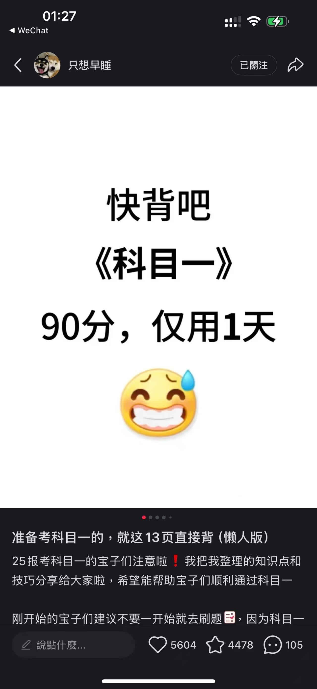
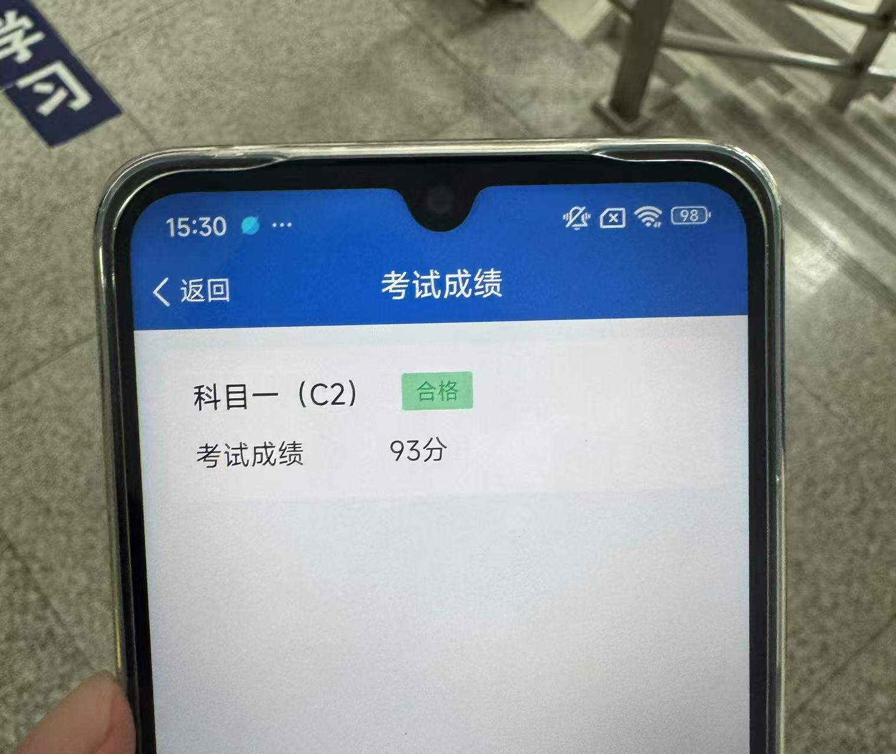

## 〇、前情提要

学车的原因：我妈觉得我爸不会开车一辈子受她欺负，不想让我像我爸一样受欺负

学车的导火索：在科大南边的路上遇到了一个法国的美女，她说她正要去报驾校，我顺便跟她一起去了

学车的前期准备：因为我的Apple ID是Apple Store美区的，无法下载“交管12123”软件，所以在淘宝上购入了一个Redmi 14C手机，4GB+128GB在国补的帮助下才花488.75，也是刷新了我对手机的认知……当然这部手机在后来对我帮助很大。

## 一、皖美学车打学时

本人在安徽报考，打学时使用的是“皖美学车”这个软件。我开始使用我的主力机进行打学时，但是在打学时的过程中就耽误了我听音乐等使用手机的时候。但是我突然意识到我的刚买的手机正好可以帮我打学时，然后我就开启了一边干自己的事情，一边看备用机上什么时候需要刷脸就刷脸的打学时历程。

## 二、约考阶段

打完了学时跟教练说约考（~~教练开始差点忘了我是谁了~~），约到了我从北京出差隔一天的下午（2025年7月10日），当时是想着科目一也不需要太多精力，火车上看看得了，后来发现我太naive了。

## 三、备考阶段

在打完学时的时候，我在闲鱼上搞了一个8.88的快通驾考小程序账号。但是截至2025年7月8日我几乎一点没看。

然后当我开始看的时候理想很丰满，我开始直接选择了小程序里的全部题目，然后一道一道练+做笔记，还特意建了一个Github的Repo，最后发现这种复习效率实在是太低了，这导致了我7月8日晚上以及7月9日整天几乎白干。直到后来半夜了我看小红书才知道应该做精选500题，然后就熬了大夜以及早起把这500题做了一遍。

当然，我的正确率惨不忍睹，我一直在想这波肯定挂科了，已经做好补考的准备了。我妈也劝我要不这次不去了，下次再约。后来我想报都报了，不如去熟悉熟悉考试环境，然后准备下午就去了。

当然，我也没有完全放弃希望，还是渴望奇迹的发生，我在小红书上找到了这种必背知识点总结，然后自己用Typora记录一遍，我会把这个笔记po到后边章节。

## 四、考试阶段

没做模拟考试，心里一点底都没有……从家到考场一路上翻看我的小笔记，进入考场之后等待期间也在看，然后考试期间就是紧张地心提到了嗓子眼。

题目右边是答题卡，10行10列，也就是每行错一个的话刚好及格，我记得前面几行都是只错一个，然后后来就有了几行全对，增加了我的容错率，倒数第二行我好像打错了两个，但是已经不影响结果了。随后93分飘过~

## 五、真心的话

实际上考试的题比软件里的题简单的多，可能难题就是一小部分。但是也不希望看官们像我一样有效学习时间不到一天就去考试。Anyway，反正已经过了，在此记录下我的科目一考试体验。

## 附件：我的笔记

（我反正几乎只看这个就过了）

- 假一吊二撤三醉五逃终生（x年内不得报考）

- 城市35，公路47（限速，无有中心线）
- 能见度261、145、52离（能见度200m 60km/h 距离100m）
- 漫水路：一停二看三低速通过
- 口五站三（50m、30m，其余150m）
- 高速
  - 两条车道（100-120，60-100）
  - 三条（110-120，90-110.60-90）
- 左边超车，右边停，提前开转向灯
  - 停车距离路边30cm
- 学法减分：
  - 公益：1h-1次-1分
  - 现场：1h-1次-2分
  - 往上：3日内-30min-1次-1分
- 驾驶证6、10、长
- 车登记，人核发
- 大客中客牵引车不可初次申领
- 驾驶证、行驶证、保险、检验合格、号牌
- 特殊路段30km/h
- 警告标志：
  - 高速公路150m
  - 普通50-100m
  - 先开警告灯，再放标识，人转移
- 
  - 红灯：右转弯不妨碍可以同行
  - 黄灯：越过线的可以继续
  - 警示灯：注意瞭望
  - 绿灯：转弯车辆不得妨碍直行、行人通过
- 
  - 3年以下：重伤、死亡、财产重大损失
  - 3-7：死亡且逃逸、逃逸或其他恶劣情节
  - 7年以上：逃逸致人死亡
- 号牌扣分：
  - 没按照规定安装：3
  - 没挂/遮挡、污损：9
  - 伪造、变造：12
- （离合），刹车/制动、油门/加速
- 
  - 大中型客车：60岁->63岁
  - 三轮车、二轮车：18-70岁
- 
  - C1/C2：18岁以上
  - C3（低速载货）：18-63岁
  - C6（轻型牵引）：20-70岁
  - B1（中客）/B2（大货）：20-63岁
  - A1（大客）/A2（重挂）：22-63岁
- 
  - 醉驾：>80mg/100ml
  - 酒驾：>20mg/100ml
- 酒驾处罚：
  - 酒驾：扣证6月，罚1-2k
  - 再次酒驾：吊销，罚1-2k，拘留10日以下
  - 营运车：吊销，罚5k，拘留15日以下，五年内不得申请
- 醉驾处罚：
  - 醉驾：吊销，刑事责任，五年内
  - 醉驾营运车：吊销，刑事责任，10年内，重新后也没法营运车
  - 饮酒后犯罪：吊销，刑事责任，终身
- 罚款20-200：
  - 实习期单独上高速、没实习标志
  - 补还后用原驾驶证
  - 30天内未申报变更
  - 小事故应该撤未撤：罚200
- 罚200-500：
  - 未审检，仍驾车
  - 身体条件
  - 隐瞒、欺骗补领证
  - 公路客运超员未到20%
- 罚20-200+15天以下拘留
  - 无证驾驶
  - 肇事逃逸，不犯罪
  - 强迫驾驶人事故，不犯罪
  - 违反不听劝阻
  - 损毁交通设施，不犯罪
  - 非法拦截扣留车辆，堵塞财产损失
- 罚200-2000+吊销
  - 改装/报废车
  - 超速50%
  - 把车给无证人驾驶
- 罚款200-2000+拆除
  - 报警器，标志灯
- 罚款1000-2000
  - 初次饮酒，扣12分，6个月驾驶证
  - 再次饮酒：吊销，10日以下拘留
- 超速：普路36，高速612
  - 普路超速20-50%，3分
  - 普路超速50%以上：6分
  - 高速超速20-50%：6分
  - 高速超速50%以上：12分
- 超员：7上69，7下36
  - 7座以上20-50%：6
  - 7座以上50%以上：9
  - 以下20-50：3
  - 以下>50：6
- 货车超载：136
  - 30%以下：1。30-50%：3。50%以上：6。
- 逆行：普路3，高速12
- 扣1分：
  - 不系安全带
  - 不按照规定年检
  - 违反禁令标志，禁止标线
  - 不正确会车
  - 不正确用灯
  - 普路不正确掉头
- 扣3分：
  - 不按照规定车道行驶
  - 不避让行人
  - 不避让校车
  - 开车接电话
  - 普路逆行
  - 穿插等候车辆
  - 未设置警告标志
  - 不按规定安装号牌
  - 高速低于规定的最低时速
  - 事故后错误用灯光
- 扣6分
  - 违反道路信号灯
  - 违法占用应急车道
  - 驾驶证暂扣期间开车
  - 轻微伤，财产损失逃逸
- 扣9分
  - 污损、遮挡、未悬挂号牌
  - 驾驶与准驾车型不符
  - 高速公路/城市快速路违法停车
- 扣12分
  - 伪造、变造驾驶证、号牌
  - 饮酒
  - 高速倒车、逆行、掉头
  - 轻伤/死亡逃逸
  - 卖分牟利
- 交警信号
  - 直行：直臂
  - 变道：捂胸
  - 停止：~~有点像德国某党派的敬礼~~
  - 左右转弯：左右手向下
  - 左转弯待转：扶伞
  - 减速慢行：slow down